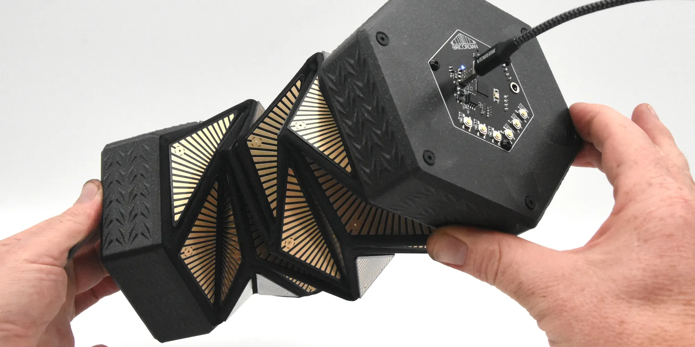

Oribotic Instruments
====================

_Why wait for a Holtzman drive to fold space when you can start folding sound, now!_

Oribotic Instruments are multi-modal capacitive sensing instruments. They afford keypad style touch, pressure sensitive "soft touch" and capacitive sensing between electrode panels (rigid PCBs on flexible substrates such as textiles) otherwise known as _Fold Sensing_.

Copyright (c) 2023 Matthew Gardiner

MIT License

Description
-----------

Our question for this work, What happens to our experience of space when we fold sound? is situated in our research into fundamental artistic methods for origami and robotics, following our central theme of Fold Sensing. Our conceptual approach is to invent foldable musical spaces rather than linear musical scores. The performer can explore the musical volume using choreographed folding paths and geometric gestures. 

Technically, oribotic instruments are layered electronics and textiles. The main elements are a capacitive sensor array from printed circuit board electrodes crafted as kinetic origami structures. The fold angles are captured in real-time and conveyed through a normalisation algorithm that adjusts for the non-linear capacitive response to the fold angle. These parametrised folded structures offer new affordances to interact, play and perform by contracting and expanding the fold geometry.

Structure
---------

* `oribotic-instrument-atmega32u4`: instrument Arduino firmware
* `puredata`: [Puredata](https://puredata.info) abstraction library and templates

Installation & Build
--------------------

For info on building and configuring the Ardunio firmware, see `oribotic-instrument-atmega32u4/README.md`

Usage
-----

Communication of the instrument with host systems is either via OSC (Open Sound Control) messages over a serial port *or* MIDI. The `comms-spec.md` markdown file lists the messaging specification for both types. Any software that can connect to a serial port or send/recieve MIDI messages should be able to receive from an Oribotic instrument.

Each foldable instrument is composed of a number of panels (8, 12, or 48) which are capcitively touch-sensitive and send the following for each panel in realtime:
* digital touch: on/off touch events
* bend: bend amount to the adjacent panel between unfolded and folded states (requires calibration)
* soft touch: amount of capcitive touch (think proximity and area/size)

As the instrument can be folded in an open-ended manner, calibration is required to send the bend low and high states: folded and unfolded, respectively. For instance, an 8 panel instrument could be folded in half, crosswise, in an origami pattern, etc the user only needs to tell the instrument when it is folded and unfolded. Panel bend values are then scaled to match.

### Puredata

An abstraction library and various templates and examples are provided both for the open-source [Puredata](https://puredata.info) computer music environment. 

Attribution
-----------

Funded through the FWF Austrian Science Fund, PEEK Program, ORI*botics on the art and science of origami and robotics https://orilab.art
Thanks to ongoing support from the Ars Electronica Futurelab https://ars.electronica.art/futurelab/

