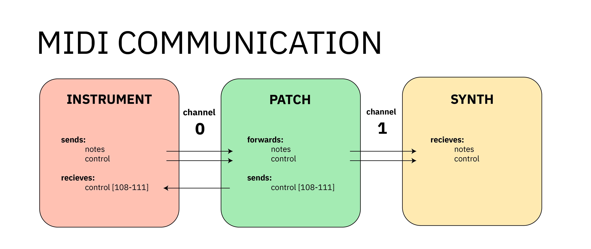

# AFFORDANCES

Using the MPR121's touch register in addition to filtered and baseline data from the MPR121, we identified four unique of gestural affordances from these instruments electrodes.

1. **Touch and Release**: the MPR121 is designed to identify touch and release interactions to each electrode. As a boolean value, these signals are useful for triggering samples or notes. 
2. **Soft Touch**: examining the filtered data following a touch and before a release affords a calculation of pressure on the sensor, as increased or decreased pressure is measurable, in small amounts. As an integer value with low range, small adjustments to volume on a sample, i.e. press harder = volume up, press lighter = volume down.
3. **Fold Sensing**: examining the filtered data at all times affords an approximation of proximity to another object. In the case of performance this can be the adjacent panel or the performer. The sensor gives no indication to the nature of the object, only that it is closer or further away. This makes for a very sensitive instrument. With a mathematical adjustment, derived from experimental test data with identical electrode pairs, we are able to estimate the angular position between the electrodes. The result is an integer value, reported as raw (MPR121->filtered) or bend range as defined during calibration, the value is generally scaled to 0-254 for OSC or 0-127 for MIDI and can be used for controlling of sound parameters. A simple example is the volume of a sound sample, a more complex use is to link the bend to one or more parametric audio operations. See Fold Sensing for detail on the sensing and calculation process.
4. **Fold Structure Sensing**: monitoring multiple electrodes to identify specific origami gestures  groups are defined using binary for code optimisation. Each panel occupies a position in the binary string. In the case of the Kresling origami, the panels are arranged in columns of 8 panels, where each binary digit refers to the one or off state of one of 8 panels, with six thereof. A panel group is defined by a switching a panel "on" in the group. Using binary, a single panel group only occupies six bytes in memory, and it describes the on or off state for every panel in the instrument. Similar to angle or bend sensing, a panel group is generally seen as a gesture recognition protocol, however the integer output is also scaled from 0-254 for OSC or 0-127 for MIDI. 

**potential function mappings**
 
- soft touch
	- control function with pressure
	- play note at velocity (volume)
- hard touch
	- play note at full velocity (volume)
- bend 
	- assignment to control function
- shape function
	- alter a global parameter

# PROTOCOL

## OSC

|    Instrument                  | Channel [range]       |   Patch                  | Channel [range] | Synth                 | Channel [range] |
|:-------------------------------|:----------------------|:-------------------------|-----------------|-----------------------|-----------------|
| **sends** notes                | /d [0-255] 0/1        | **receives** notes       | /d [0-255]      |                       |                 |
| **sends** control              | /b /s [0-255]         | **receives** control     |                 |                       |                 |
| **send triggers**:             |                       | **forwards triggers**    |                 |                       |                 |
| **touch**                      | /d [0-255] 1/0        | **forwards** notes       | 1 [custom]      | **receives** notes    | 1 [0-127]       |
| **bend**                       | /b                    | **forwards** control     | 1 [custom]      | **receives** control  | 1 [0-127]       |
| y8                             | /b [0-7]              | **forwards** control     | 1 [custom]      | **receives** control  | 1 [custom]      |
| suki                           | /b [0-11]             | **forwards** control     | 1 [custom]      | **receives** control  | 1 [custom]      |
| oricordion                     | /b [0-47]             | **forwards** control     | 1 [custom]      | **receives** control  | 1 [custom]      |
| **soft touch**                 | /s                    |                          |                 |                       |                 |
| y8                             | /s [8-15]             | **forwards** control     | 1 [custom]      | **receives** control  | 1 [custom]      |
| suki                           | /s [12-23]            | **forwards** control     | 1 [custom]      | **receives** control  | 1 [custom]      |
| oricordion                     | /s [48-95]            | **forwards** control     | 1 [custom]      | **receives** control  | 1 [custom]      |
| **panel group**                | /s                    |                          |                 |                       |                 |
| y8                             | /g [0-x]              | **forwards** control     | 1 [custom]      | **receives** control  | 1 [custom]      |
| suki                           | /g [0-x]              | **forwards** control     | 1 [custom]      | **receives** control  | 1 [custom]      |
| oricordion                     | /g [0-x]              | **forwards** control     | 1 [custom]      | **receives** control  | 1 [custom]      |
| **control ranges**             |                       |                          |                 |                       |                 |
| y8 8 panels                    | 0 [0-15]              | **forwards** control     | 1 [custom]      | **receives** control  | 1 [custom]      |
| suki 12 panels                 | 0 [0-23]              | **forwards** control     | 1 [custom]      | **receives** control  | 1 [custom]      |
| oricordion  28 panels          | 0 [0-95]              | **forwards** control     | 1 [custom]      | **receives** control  | 1 [custom]      |
| **receives**                   | /set/                 | **sends to instrument**  |                 |                       |                 |
| set Hard                       | /setKey/hard/[key]    | **sends to instrument**  |                 |                       |                 |
| set Soft                       | /setKey/soft/[key]    | **sends to instrument**  |                 |                       |                 |
| set bendLO                     | /setKey/belo/[key]    | **sends to instrument**  |                 |                       |                 |
| set bendHI                     | /setKey/behi/[key]    | **sends to instrument**  |                 |                       |                 |
| set bendLO Hard Soft           | /setKey/behs/[key]    | **sends to instrument**  |                 |                       |                 |
| calibrate                      | /calibrate            | **sends to instrument**  |                 |                       |                 |
| mode                           | /mode/[modenum]       | **sends to instrument**  |                 |                       |                 |
| note set base                  | /root/[rootnote]      | **sends to instrument**  |                 |                       |                 |
| major 0 / minor 1              | /scale/[0/1]          | **sends to instrument**  |                 |                       |                 |
| mpr report                     | /mpr/[0-4]            | **from instrument**      |                 |                       |                 |
| set scale                      | /scale/[0-127]        | **from instrument**      |                 |                       |                 |
| set scale                      | /scale/[majo/mino]    | **from instrument**      |                 |                       |                 |

MIDI
----

{width="95%"}

|    Instrument                  | Channel [range] |   Patch                  | Channel [range] | Synth                 | Channel [range] |
|:-------------------------------|:----------------|:-------------------------|-----------------|-----------------------|-----------------|
| **sends** notes                | 0  [0-127]      | **receives** notes       | 0 [0-127]       |                       |                 |
| **sends** control              | 0  [0-95]       | **receives** control     | 0 [0-127]       |                       |                 |
| **send triggers**:             |                 | **forwards triggers**    |                 |                       |                 |
| **touch**                      | noteon/noteoff  | **forwards** notes       | 1 [0-127]       | **receives** notes    | 1 [0-127]       |
| **bend**                       | control, value  |                          |                 |                       |                 |
| y8                             | 0 [0-7]         | **forwards** control     | 1 [custom]      | **receives** control  | 1 [custom]      |
| suki                           | 0 [0-11]        | **forwards** control     | 1 [custom]      | **receives** control  | 1 [custom]      |
| oricordion                     | 0 [0-47]        | **forwards** control     | 1 [custom]      | **receives** control  | 1 [custom]      |
| **soft touch**                 | control, value  |                          |                 |                       |                 |
| y8                             | 0 [8-15]        | **forwards** control     | 1 [custom]      | **receives** control  | 1 [custom]      |
| suki                           | 0 [12-23]       | **forwards** control     | 1 [custom]      | **receives** control  | 1 [custom]      |
| oricordion                     | 0 [48-95]       | **forwards** control     | 1 [custom]      | **receives** control  | 1 [custom]      |
| **control ranges**             |                 |                          |                 |                       |                 |
| y8 8 panels                    | 0 [0-15]        | **sends to instrument**  |                 |                       |                 |
| suki 12 panels                 | 0 [0-23]        | **sends to instrument**  |                 |                       |                 |
| oricordion  28 panels          | 0 [0-95]        | **sends to instrument**  |                 |                       |                 |
| **panel group**                |                 |                          |                 |                       |                 |
| y8 8 panels                    | 0 [100-x]       | **sends to instrument**  |                 |                       |                 |
| suki 12 panels                 | 0 [100-x]       | **sends to instrument**  |                 |                       |                 |
| oricordion  28 panels          | 0 [100-x]       | **sends to instrument**  |                 |                       |                 |
| **receives**                   | 0 [111]         | **sends to instrument**  |                 |                       |                 |
| set Hard                       | 0 [111] 0       | **sends to instrument**  |                 |                       |                 |
| set Soft                       | 0 [111] 5       | **sends to instrument**  |                 |                       |                 |
| set bendLO                     | 0 [111] 10      | **sends to instrument**  |                 |                       |                 |
| set bendHI                     | 0 [111] 15      | **sends to instrument**  |                 |                       |                 |
| set bendLO Hard Soft           | 0 [111] 20      | **sends to instrument**  |                 |                       |                 |
| calibrate                      | 0 [111] 100     | **sends to instrument**  |                 |                       |                 |
| mode                           | 0 [110] [0-127] | **sends to instrument**  |                 |                       |                 |
| note set base                  | 0 [109] [0-127] | **sends to instrument**  |                 |                       |                 |
| set scale major 0 / minor      | 0 [108] [0-1]   | **sends to instrument**  |                 |                       |                 |
| mpr121 report A                | 0 [107] [0-1]   | **sends to instrument**  |                 |                       |                 |
| mpr121 report B                | 0 [106] [0-1]   | **sends to instrument**  |                 |                       |                 |
| mpr121 report C                | 0 [105] [0-1]   | **sends to instrument**  |                 |                       |                 |
| mpr121 report D                | 0 [104] [0-1]   | **sends to instrument**  |                 |                       |                 |
| set scale                      | 0 [103] [0-7]   | **sends to instrument**  |                 |                       |                 |
| report notes in scale          | 0 [103][p][note]| **from instrument**      |                 |                       |                 |
| report scale type              | 0 [103] 100-107 | **from instrument**      |                 |                       |                 |
| FFI                            | 0 [112] [0-5]   | **sends to instrument**  |                 |                       |                 |
| SF1                            | 0 [113] [0-5]   | **sends to instrument**  |                 |                       |                 |
| Interval                       | 0 [114] [0-5]   | **sends to instrument**  |                 |                       |                 |
| CDT                            | 0 [115] [0-5]   | **sends to instrument**  |                 |                       |                 |
| SF1                            | 0 [113] [0-5]   | **sends to instrument**  |                 |                       |                 |
